# FTC Network Project
> Multi-floor enterprise network | Cisco Packet Tracer | March 2026

## Project Summary

A complete enterprise network simulation for **FTC CLUB** — a multi-floor organization
with 9 VLANs, hierarchical three-tier architecture, centralized DHCP, inter-VLAN routing,
NAT, ACL-based security, and SSH management restricted to the IT department.
The network serves 30+ end devices across 3 floors and 9 departments,
all implemented and tested in Cisco Packet Tracer.

---

## Authors

- **TABLENNENAS Ismail** —

- **MAZARI Wassim** —

- **TOUAL Mohamed Amine** —
)

- **ZEGHDOUDI Abdelbari** —

---

## Table of Contents

- [Topology](#topology)
- [Architecture](#architecture)
- [Floor 1 — Administration & Server Room](#floor-1--administration--server-room)
- [Floor 2 — Data, Development, Media & Logistics](#floor-2--data-development-media--logistics)
- [Floor 3 — IT, Sports & Culture, External Relations](#floor-3--it-sports--culture--external-relations)
- [VLAN Plan](#vlan-plan)
- [IP Addressing](#ip-addressing)
- [Routing](#routing)
- [DHCP](#dhcp)
- [Security — ACLs, NAT & SSH](#security--acls-nat--ssh)
- [Testing & Verification](#testing--verification)
- [Features Implemented](#features-implemented)

---

# Topology

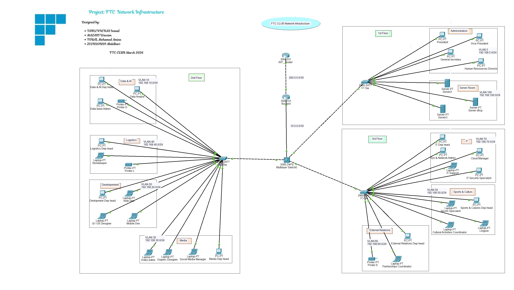

---

## Architecture

The network follows a **3-tier hierarchical design**

| Tier | Device | Role |
|------|--------|------|
| Tier 1 — WAN | ISP-Router (ISR4331) | Simulates Internet — IP 200.0.0.2, Loopback 8.8.8.8 |
| Tier 2 — Core | 3560-24PS Multilayer Switch | L3 Inter-VLAN routing, ACL enforcement |
| Tier 3 — Access | F1-SW / F2-SW / F3-SW (2960) | L2 access per floor via trunk links to core |

---

## Floor 1 — Administration & Server Room

Floor 1 uses a star topology connected to the Core Switch via trunk link.
Two VLANs serve this floor — Administration and the centralized Server Room.

### Administration (VLAN 5)

- Network: 192.168.5.0/24
- Gateway (Core SVI): 192.168.5.1
- Ports: Fa0/1 – Fa0/8
- Devices: President, Vice-President, General Secretary, HR Director
- DHCP: Assigned automatically from Server-DHCP 

### Server Room (VLAN 100)

- Network: 192.168.100.0/24
- Gateway (Core SVI): 192.168.100.1
- Ports: Fa0/9 – Fa0/16
- Devices: Server2, Server3, Server-DHCP (Static IP: 192.168.100.10)

---

## Floor 2 — Data, Development, Media & Logistics

Floor 2 uses a star topology with 4 VLANs served by F2-SW (Catalyst 2960).
All devices receive IPs automatically via DHCP server. Printers have static IPs.

### Data & AI (VLAN 10)

- Network: 192.168.10.0/24 — Gateway: 192.168.10.1
- Ports: Fa0/1 – Fa0/5
- Devices: Data Dep Head, Data Analyst, DB Admin, Printer D (192.168.10.200)

### Development (VLAN 20)

- Network: 192.168.20.0/24 — Gateway: 192.168.20.1
- Ports: Fa0/6 – Fa0/11
- Devices: Dev Dep Head, Web Dev, UI/UX Designer, Mobile Dev

### Media (VLAN 30)

- Network: 192.168.30.0/24 — Gateway: 192.168.30.1
- Ports: Fa0/12 – Fa0/16
- Devices: Video Editor, Graphic Designer, Social Media Manager, Media Dep Head

### Logistics (VLAN 40)

- Network: 192.168.40.0/24 — Gateway: 192.168.40.1
- Ports: Fa0/17 – Fa0/21
- Devices: Logistics Dep Head, Storekeeper, Printer L (192.168.40.200)

---

## Floor 3 — IT, Sports & Culture, External Relations

Floor 3 uses a star topology with 3 VLANs served by F3-SW (Catalyst 2960).
The IT department has special privileges — internet access and SSH management.

### Sports & Culture (VLAN 50)

- Network: 192.168.50.0/24 — Gateway: 192.168.50.1
- Ports: Fa0/1 – Fa0/6
- Devices: Sports Specialist, SC Dep Head, Cultural Activities Coordinator, Linguist

### External Relations (VLAN 60)

- Network: 192.168.60.0/24 — Gateway: 192.168.60.1
- Ports: Fa0/7 – Fa0/11
- Devices: External Relations Dep Head, Partnerships Coordinator, Printer E (192.168.60.200)

### IT Department (VLAN 70)

- Network: 192.168.70.0/24 — Gateway: 192.168.70.1
- Ports: Fa0/12 – Fa0/18
- Devices: IT Dep Head, Sys & Network Admin, Cloud Manager, IT Support, IT Security Specialist
- Notes: Only VLAN with internet access + SSH management rights

---

## VLAN Plan

| VLAN | Name | Network | Gateway | Floor | Department |
|------|------|---------|---------|-------|------------|
| 5 | ADMIN | 192.168.5.0/24 | 192.168.5.1 | 1st | Administration |
| 10 | DATA | 192.168.10.0/24 | 192.168.10.1 | 2nd | Data & AI |
| 20 | DEV | 192.168.20.0/24 | 192.168.20.1 | 2nd | Development |
| 30 | MEDIA | 192.168.30.0/24 | 192.168.30.1 | 2nd | Media |
| 40 | LOGISTICS | 192.168.40.0/24 | 192.168.40.1 | 2nd | Logistics |
| 50 | SC | 192.168.50.0/24 | 192.168.50.1 | 3rd | Sports & Culture |
| 60 | RELATIONS | 192.168.60.0/24 | 192.168.60.1 | 3rd | External Relations |
| 70 | IT | 192.168.70.0/24 | 192.168.70.1 | 3rd | IT Department |
| 100 | SERVERS | 192.168.100.0/24 | 192.168.100.1 | 1st | Server Room |

---

## IP Addressing

| Segment | Device | Interface | IP Address | Subnet |
|---------|--------|-----------|------------|--------|
| Core ↔ Router | Core Switch | G0/1 | 10.0.0.1 | /30 |
| Core ↔ Router | Router0 | G0/0/0 | 10.0.0.2 | /30 |
| Router ↔ ISP | Router0 | G0/0/1 | 200.0.0.1 | /30 |
| Router ↔ ISP | ISP-Router | G0/0/0 | 200.0.0.2 | /30 |
| Internet Simulation | ISP-Router | Loopback0 | 8.8.8.8 | /32 |
| DHCP Server | Server-DHCP | NIC | 192.168.100.10 | /24 |

---

## Routing

Inter-device links and routing configuration:

- Core Switch ↔ Router0: `10.0.0.0/30` (Core: 10.0.0.1 — Router: 10.0.0.2)
- Router0 ↔ ISP-Router: `200.0.0.0/30` (Router: 200.0.0.1 — ISP: 200.0.0.2)

Routing configuration:

> On Core Switch
ip routing
ip route 0.0.0.0 0.0.0.0 10.0.0.2

> On Router0
ip route 192.168.0.0 255.255.0.0 10.0.0.1
ip route 0.0.0.0 0.0.0.0 200.0.0.2

| Type | Detail |
|------|--------|
| Inter-VLAN | Layer 3 SVIs on Core Switch — 9 SVIs total |
| Static Route | Router0 → Core for all internal VLANs |
| Default Route | Core → Router0 → ISP for internet |
| NAT | PAT overload on Router0 G0/0/1 (outside) |

---

## DHCP

- DHCP Server: `Server-DHCP` — Static IP `192.168.100.10` in VLAN 100
- All 9 VLANs receive IP addresses automatically
- Printers use static IPs to support ACL-based isolation

---

## Security — ACLs, NAT & SSH

### Internet Access (Extended ACL)

> Only IT (VLAN 70) and Admin (VLAN 5) can reach internet

access-list 100 permit ip 192.168.70.0 0.0.0.255 any

access-list 100 permit ip 192.168.5.0 0.0.0.255 any

access-list 100 deny ip any any

### Printer Isolation (Extended ACL)

> Printers accessible only from own VLAN 
> Applied on Core Switch SVIs

### NAT Overload (PAT)

ip nat inside source list 100 interface G0/0/1 overload

### SSH — Restricted to IT Only 

| Device | Role | Management IP | VLAN | Access |
|--------|------|--------------|------|--------|
| Core Switch (3560-24PS) | L3 Core | 192.168.5.1 | VLAN 5 | IT Only |
| F1-SW (2960) | 1st Floor Access | 192.168.5.200 | VLAN 5 | IT Only |
| F2-SW (2960) | 2nd Floor Access | 192.168.10.200 | VLAN 10 | IT Only |
| F3-SW (2960) | 3rd Floor Access | 192.168.70.200 | VLAN 70 | IT Only |
| Router0 (ISR4331) | WAN Gateway | 10.0.0.2 | WAN Link | IT Only |

---
## Testing & Verification

A systematic testing plan was conducted to validate all network features
and confirm full connectivity across all VLANs, floors, and services.

---

### Connectivity Tests

| Test | Source | Destination | Result | 
|------|--------|-------------|----------|
| Inter-VLAN | Med PC (VLAN 20) | IT PC (VLAN 70) | ✅ Success | 
| Intra-VLAN | Admin PC (VLAN 5) | Admin PC (VLAN 5) | ✅ Success | 
| DHCP | All VLANs | Server-DHCP (192.168.100.10) | ✅ IP Assigned | 
| Default Gateway | Any PC | Core Switch SVI | ✅ Reachable | 

**Intra-VLAN Ping Test:**

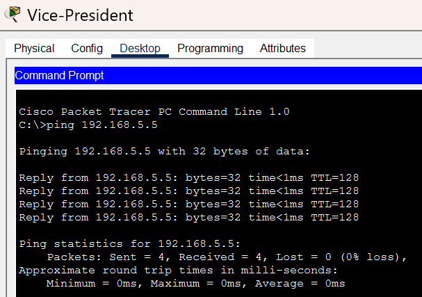

**Inter-VLAN Ping Test:**

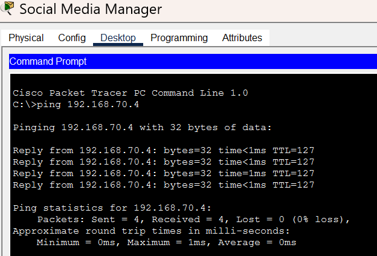

---

### Internet Access Tests (NAT + ACL)

| Test | Source | Destination | Result | 
|------|--------|-------------|----------|
| Internet allowed | IT PC (VLAN 70) | 8.8.8.8 | ✅ Reachable | 
| Internet allowed | Admin PC (VLAN 5) | 8.8.8.8 | ✅ Reachable | 
| Internet blocked | Dev PC (VLAN 20) | 8.8.8.8 | ❌ Blocked | 
| Internet blocked | Media PC (VLAN 30) | 8.8.8.8 | ❌ Blocked | 
| Internet blocked | Logistics PC (VLAN 40) | 8.8.8.8 | ❌ Blocked | 

**IT Internet Access (Allowed):**

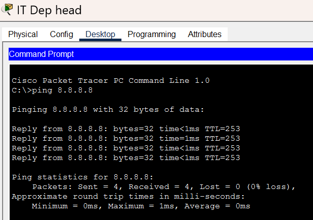

**Dev Internet Access (Blocked):**

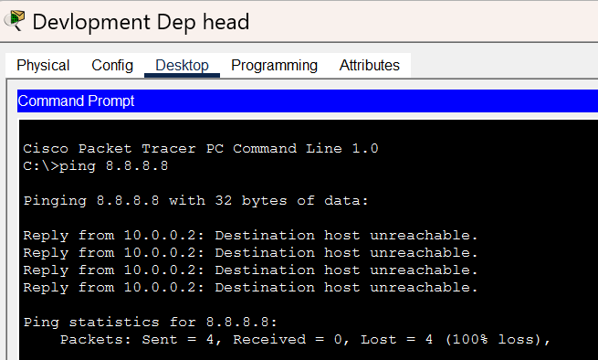

---

### Printer Isolation Tests (ACL)

| Test | Source | Destination | Result | 
|------|--------|-------------|----------|
| Own dept access | Logist PC (VLAN 40) | Printer L (192.168.40.3) | ✅ Reachable | 
| Cross-dept blocked | Data PC (VLAN 10) | Printer L (192.168.40.3) | ❌ Blocked | 
| Cross-dept blocked | Media PC (VLAN 30) | Printer L (192.168.40.3) | ❌ Blocked | 

**Printer Access from Own Department:**

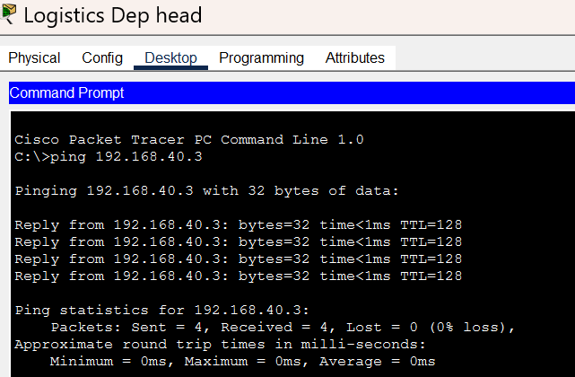

**Printer Access Blocked from Other Department:**

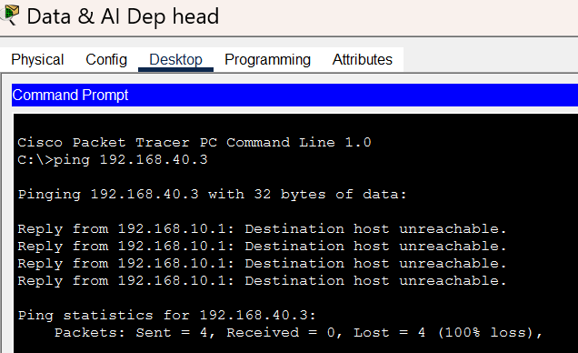

---

### SSH Management Tests

| Test | Source | Destination | Result | 
|------|--------|-------------|----------|
| SSH allowed | IT PC (VLAN 70) | Core Switch | ✅ Connected | 
| SSH allowed | IT PC (VLAN 70) | F1-SW | ✅ Connected | 
| SSH blocked | Admin PC (VLAN 5) | Core Switch | ❌ Blocked | 
| SSH blocked | Dev PC (VLAN 20) | Core Switch | ❌ Blocked | 

**SSH Successful Login from IT PC:**

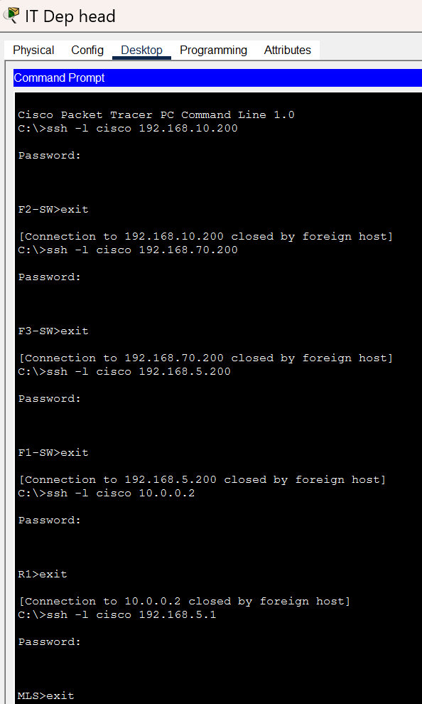

**SSH Blocked from Admin :**

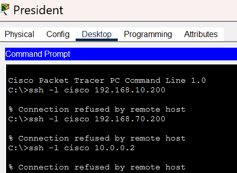

---

### DHCP Relay Tests

| Test | VLAN | Expected IP Range | Result |
|------|------|-------------------|--------|
| DHCP assigned | VLAN 5 | 192.168.5.x | ✅ Pass |
| DHCP assigned | VLAN 10 | 192.168.10.x | ✅ Pass |
| DHCP assigned | VLAN 20 | 192.168.20.x | ✅ Pass |
| DHCP assigned | VLAN 70 | 192.168.70.x | ✅ Pass |

**DHCP IP Assignment on PC:**

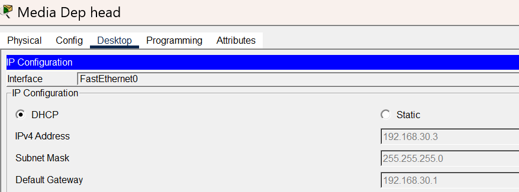

**DHCP Bindings on Server:**

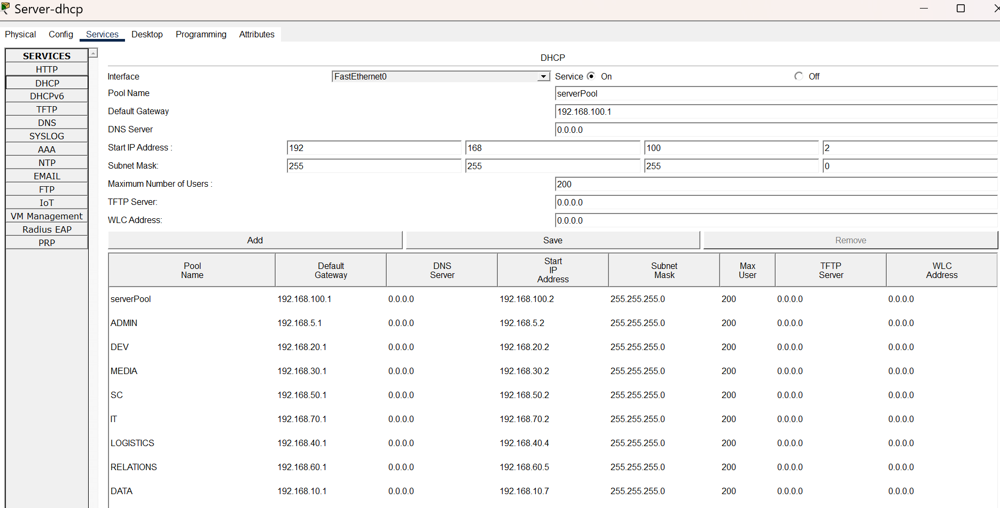

---

*© FTC CLUB — March 2026 | Network Infrastructure Project*
